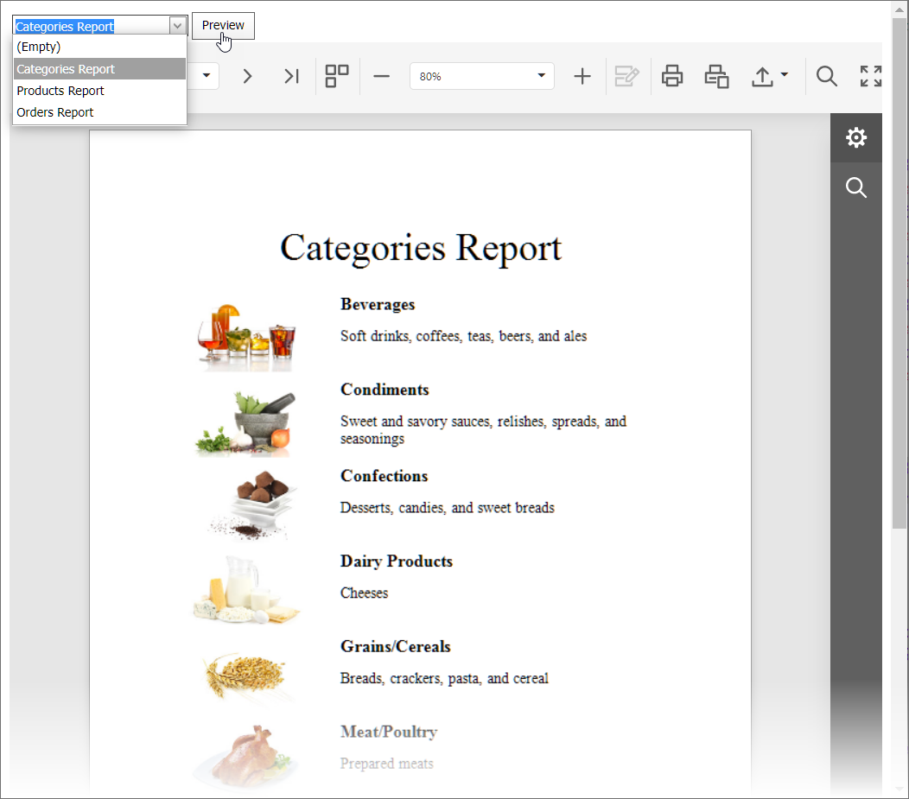

<!-- default badges list -->

<!-- default badges end -->
# Reporting for Web Forms - How to Load a Report at Runtime in the Document Viewer

This example demonstrates how to load a report to the [Web Document Viewer](https://docs.devexpress.com/XtraReports/17738/web-reporting/asp-net-webforms-reporting/document-viewer) control at runtime on a button click. 

The client-side button `Click` event passes a report name to the client-side [OpenReport](https://docs.devexpress.com/XtraReports/js-ASPxClientWebDocumentViewer#js_aspxclientwebdocumentviewer_openreport_url_) method. A custom [IReportProvider](https://docs.devexpress.com/XtraReports/DevExpress.XtraReports.Services.IReportProvider) descendant service translates a report name to a report instance. 

## Files to Review

* [Default.aspx](./CS/Default.aspx) (VB: [Default.aspx](./VB/Default.aspx))
* [Default.aspx.cs](./CS/Default.aspx.cs) (VB: [Default.aspx.vb](./VB/Default.aspx.vb))
* [ReportProvider.cs](./CS/Services/ReportProvider.cs (VB: [ReportProvider.vb](./VB/Services/ReportProvider.vb)))

## Documentation
- [Web Document Viewer](https://docs.devexpress.com/XtraReports/401850/web-reporting/web-document-viewer)
- [Register Services in the Document Viewer](https://docs.devexpress.com/XtraReports/118435/web-reporting/asp-net-webforms-reporting/document-viewer-in-asp-net-webforms-reporting/customization/register-services-in-the-document-viewer)

## More Examples

- [Reporting for WebForms - How to Dynamically Generate a Report for a Table or Query](https://github.com/DevExpress-Examples/reporting-generate-report-dynamically-for-specified-query)
